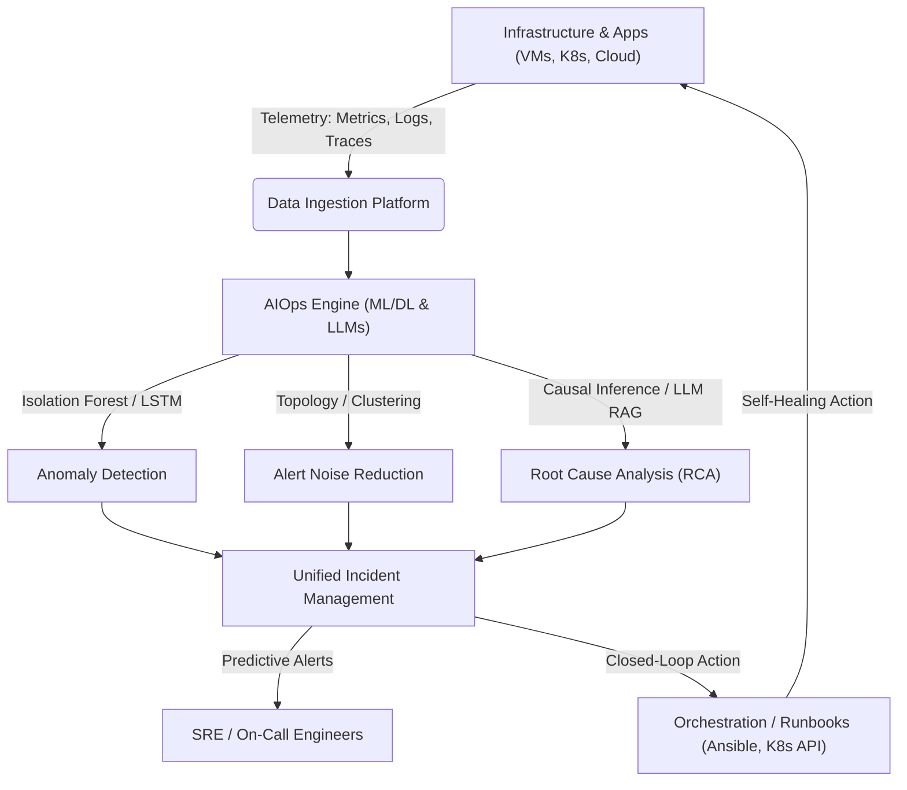

# AIOps (Artificial Intelligence for IT Operations) Use Cases Guide

This guide provides a comprehensive overview of **AIOps**, outlining why it is required in modern architectures, when it should be implemented, the tangible achievements of integrating it into an infrastructure, and 10 real-world use cases with detailed examples.

---

## 1. The Core Telemetry Loop

The diagram below illustrates how AIOps sits on top of standard telemetry systems, transforming passive data (metrics, logs, traces) into proactive, automated remediation.

---

## 2. Why AIOps is Required (The Pain Points)

Traditional, human-only operations systems are failing under the weight of modern infrastructure complexity. AIOps is required to bridge the gap in several critical areas:

*   **The Data Deluge:** Modern microservices and cloud-native setups generate gigabytes of metrics, logs, and traces per second. Humans cannot monitor or parse this volume of data in real-time.
*   **Alert Fatigue:** Standard monitoring tools rely on static thresholds (e.g., alert if CPU > 80%). This results in thousands of daily alerts, most of which are noise. Real issues get lost in the noise.
*   **Architectural Complexity:** Dynamic architectures like Kubernetes spin up and tear down containers continuously. Static rules cannot scale with transient, shifting network topologies.
*   **Siloed Operations:** Dev, Ops, and Security teams use separate tools, creating fragmented visibility. AIOps unifies these data streams to find cross-domain correlations.
*   **Reactive Post-Mortems:** Traditional operations are **reactive**—remediating issues after they impact customers. AIOps shifts the paradigm to **predictive and proactive** management.

---

## 3. When AIOps Will Be Used (Trigger Scenarios)

An organization typically adopts AIOps when they encounter the following triggers:

1.  **Multi-Cloud & Hybrid Cloud Scaling:** When infrastructure expands across multiple public clouds (AWS, Azure, GCP) and on-premises environments, making centralized manual management impossible.
2.  **High CI/CD Velocity:** When developers push code to production multiple times a day, making it difficult to trace which deployment caused a degradation.
3.  **Unacceptable Mean Time to Resolution (MTTR):** When resolving production outages takes hours of searching through distributed logs and dashboard hopping, leading to costly downtime.
4.  **Recurrent "Transient" Issues:** When the same database lock or memory leak recurs intermittently, but engineers lack the data correlation capability to solve the underlying root cause.

---

## 4. What We Can Achieve in Infrastructure with AIOps

Implementing AIOps elevates the reliability and efficiency of an infrastructure:

| Capability | Traditional Ops | AIOps Enabled | Business Value |
| :--- | :--- | :--- | :--- |
| **Incident Detection** | Reactive (User reports outage or static alert fires) | Proactive (Dynamic anomalies detected before failure) | Minimizes SLA breaches, protects brand reputation |
| **Noise Reduction** | High alert volume (alert storms, duplicates) | Correlated alert groups (90%+ noise reduction) | Reduces cognitive load and burnout for on-call engineers |
| **Root Cause Analysis** | Manual log searching and command line triage | Automated correlation and root cause suggestions | Reduces MTTR from hours to minutes |
| **Resource Management** | Static provisioning (over-provisioning to avoid crashes) | Dynamic autoscaling & predictive capacity planning | Cuts cloud infrastructure waste by 30-50% |
| **Remediation** | Manual runbooks and engineer intervention | Automated self-healing (closed-loop runbooks) | Instant recovery for common infrastructure failures |

---

## 5. 10 Real-World AIOps Use Cases

Here are 10 core AIOps use cases, including the underlying machine learning models and concrete real-world examples:

### Use Case 1: Dynamic Thresholding & Anomaly Detection
*   **The Problem:** Static thresholds fail to account for natural business cycles (e.g., higher traffic on Monday mornings than Sunday nights). If CPU thresholds are set too low, they alert constantly; if set too high, they miss early degradation.
*   **AIOps Solution:** Machine learning models (e.g., ARIMA, Prophet, or LSTM Autoencoders) learn seasonal historical patterns and establish a dynamic "band" of normal behavior. Alerts are only fired when telemetry moves outside this dynamically adjusted band.
*   **Real-World Example:** An e-commerce platform during Black Friday sees CPU utilization rise from a normal 30% baseline to 95%. Rather than flagging this as a critical failure (since traffic is also 10x), the AIOps engine recognizes it as seasonal normal. However, if database write times deviate by even 5% during this period, it flags a dynamic anomaly immediately.

### Use Case 2: Alert Correlation & Noise Reduction
*   **The Problem:** When a core switch or database goes down, hundreds of downstream applications and services start failing simultaneously, triggering an "alert storm." On-call engineers are inundated with notifications and cannot isolate the source.
*   **AIOps Solution:** The system maps the infrastructure topology (using APM traces and network graphs) and uses clustering algorithms (like DBSCAN or Graph Neural Networks) to group hundreds of related alerts into a single unified incident page.
*   **Real-World Example:** A central database cluster runs out of memory. This triggers 250 alerts from web servers, payment gateways, and shipping services. AIOps groups all 250 alerts under one parent incident labeled: "Database Cluster Node A: Out of Memory," suppressing the downstream noise.

### Use Case 3: Automated Root Cause Analysis (RCA) with LLMs & RAG
*   **The Problem:** Even after identifying an incident, engineers spend hours reading stack traces and logs to identify what changed and how to fix it.
*   **AIOps Solution:** Utilizing Retrieval-Augmented Generation (RAG) combined with an LLM, the AIOps system extracts stack traces, queries past post-mortem documents, and scans recent deployment commits to output a natural language explanation of the cause and a proposed fix.
*   **Real-World Example:** A service crashes with a `NullPointerException`. The LLM agent queries past incident records, finds a matching case from six months ago, scans the git diff from a deployment 10 minutes prior, and alerts the engineer: *"This crash is 98% similar to Incident-412. It was caused by commit `e8a9f2` which removed a default value check for user profiles. Reverting this commit or applying patch `hotfix-412` will resolve it."*

### Use Case 4: Predictive Capacity Planning & Storage Forecasting
*   **The Problem:** Suddenly running out of disk space or database capacity causes immediate data corruption and downtime. Conversely, over-provisioning servers leads to massive waste.
*   **AIOps Solution:** Regression models and time-series forecasting calculate future resource exhaust dates based on historical growth, data ingestion rates, and seasonal trends.
*   **Real-World Example:** A financial service's transaction log disk is filling up. AIOps analyzes the write trend and projects that disk capacity will hit 100% in exactly 14 days. It automatically files a low-priority Jira ticket for the platform team to expand the volume, resolving the issue weeks before a critical crash occurs.

### Use Case 5: Log Anomaly Detection
*   **The Problem:** Logs contain millions of lines of routine operations text. A critical error log can easily be missed until the system completely fails.
*   **AIOps Solution:** Natural Language Processing (NLP) tokenizes log statements, groups them using clustering (e.g., Drain log parser), and identifies structural anomalies—such as an unexpected frequency of a specific template, or the appearance of a brand new log pattern.
*   **Real-World Example:** After a deployment, the system metrics look healthy (CPU/Memory normal). However, the AIOps engine detects that a rare log message—`DatabaseConnectionPoolTimeoutException`—which has never appeared in the last 60 days, is suddenly appearing 15 times a minute. It alerts engineers to a connection leak before users notice performance degradation.

### Use Case 6: Change Impact Analysis (Deployment Risk Profiling)
*   **The Problem:** Up to 80% of outages are caused by code deployments or configuration changes. Identifying which micro-deployment introduced a regression is incredibly difficult in continuous deployment pipelines.
*   **AIOps Solution:** AIOps automatically profiles the behavior of a canary deployment or new release for 10-15 minutes, comparing its latency, error rate, and system calls against the baseline of the active production version using statistical tests (like the Kolmogorov-Smirnov test).
*   **Real-World Example:** A developer merges a pull request. The CI/CD pipeline deploys the new version to a 5% canary. AIOps detects that while overall application latency remains within the SLA, the canary pod's memory usage is growing by 5MB per minute (a memory leak). The AIOps engine commands the deployment controller to automatically halt and roll back the release.

### Use Case 7: Automated Self-Healing & Runbook Orchestration
*   **The Problem:** System administrators spend valuable time performing repetitive remediation tasks, like restarting crashed containers, clearing temporary log caches, or blocking malicious IP addresses.
*   **AIOps Solution:** An orchestration engine linked to the AIOps alert output executes pre-validated remediation scripts when specific, high-confidence anomalies are detected.
*   **Real-World Example:** A Kubernetes pod experiences a thread pool lockup and stops responding to health checks. The AIOps anomaly detector matches this signature to a known lockup pattern. It triggers an automated Webhook to the Kubernetes API to execute a graceful rolling restart of the pod, logging the stack trace for developers to inspect later.

### Use Case 8: SLA & SLO Breach Prediction
*   **The Problem:** Companies face financial penalties when SLAs (Service Level Agreements) are breached. Traditional alerts only trigger *after* the breach has occurred.
*   **AIOps Solution:** AIOps constantly calculates the rolling compliance windows for SLAs/SLOs, using trend projection models to identify when a system is on a path to breach its agreement hours in advance.
*   **Real-World Example:** A cloud API gateway's 99th-percentile response time rises to 180ms. The SLO is 99% of requests completed under 200ms over a rolling 30-day window. AIOps calculates that if the latency remains at 180ms for 3 more hours, the rolling monthly SLO budget will be fully consumed. It triggers a critical PagerDuty alert to spin up additional geo-replicated instances.

### Use Case 9: Intelligent Incident Routing & Assignment
*   **The Problem:** When an outage occurs, alerts are often sent to a general helpdesk or routed to the wrong engineering team, wasting precious time while the ticket is manually reassigned.
*   **AIOps Solution:** Text classification models read the metadata, logs, and stack traces of a new incident, comparing them to historical ticket data to determine which specialized team is best equipped to resolve it.
*   **Real-World Example:** A database replica lag alert fires, accompanied by a network timeout. The AIOps system analyzes the logs, recognizes the network switch identifier in the telemetry, bypasses the database team, and routes the ticket directly to the Network Engineering Team with a high priority.

### Use Case 10: Trace Path Latency Bottleneck Detection
*   **The Problem:** In a complex microservice architecture, a single user transaction might traverse 50 different services. If a request is slow, finding exactly which service call or database query caused the delay is like finding a needle in a haystack.
*   **AIOps Solution:** Graph analysis and path latency models analyze distributed APM trace trees, isolating abnormal paths and highlighting the exact downstream dependency or database query that introduced the outlier latency.
*   **Real-World Example:** A customer's checkout button takes 6 seconds to load. AIOps analyzes the distributed trace graph for the checkout request, automatically drills down five layers deep, and identifies that a legacy third-party inventory check API took 5.8 seconds to respond. It flags this specific API call as the latency bottleneck.
